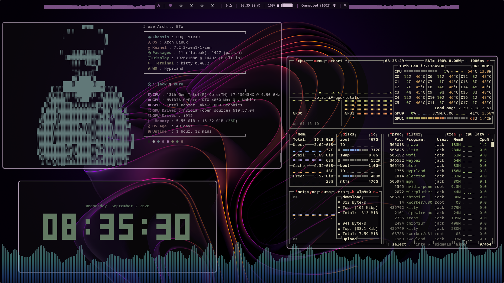
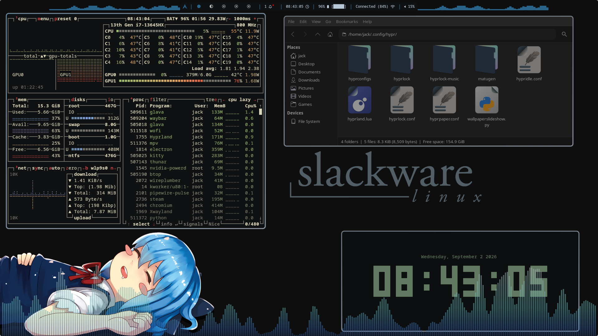
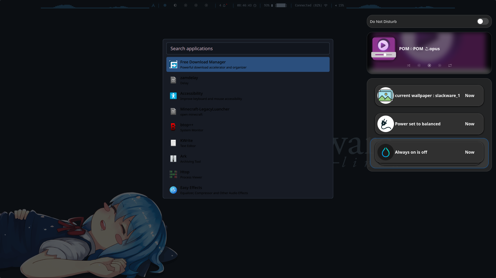
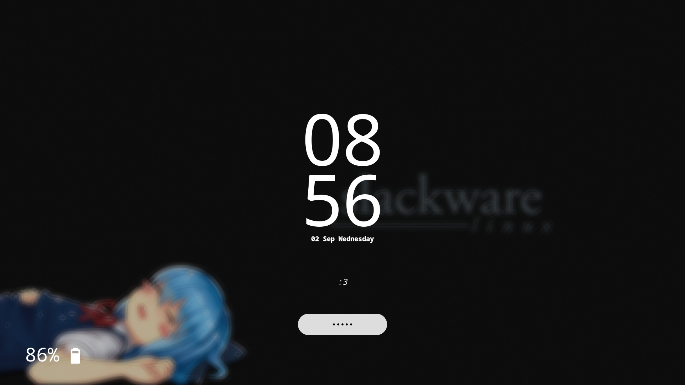

# hypr-rice 🐧

my personal Hyprland setup. built it up over time, tweaked it way too much, and now it's actually pretty solid so figured i'd share it.

themed Waybar, Hyprlock, some animations, quickshell stuff, a bunch of scripts to glue it all together. it's minimal-ish but has a lot of binds and quality-of-life stuff packed in.

## screenshots

| | |
|---|---|
|  |  |
|  |  |



## what's in here

- `.config/` — all the actual configs (hyprland, waybar, hyprlock, quickshell, etc.)
- `.scripts/` — helper scripts used around the rice
- `.bashrc` — my bash setup
- `python-yt-project/` — random side thing, unrelated to the rice itself

## do i need all of it?

nah. everything's kept fairly modular so you can just grab the parts you want instead of the whole rice. like if you just want the waybar config or the hyprlock theme, just take that folder and go, you don't need to install everything else with it.

## installing

1. clone the repo
```bash
git clone https://github.com/jack02134x/hypr-rice.git
```
2. look through `.config/` and copy over whatever you want into your own `~/.config/`
3. check the scripts folder for anything the configs depend on (some binds/animations call scripts directly)
4. restart hyprland / reload configs and you're good

⚠️ as always with rices, don't just blindly copy-paste everything over your existing setup, go through it first so you know what you're adding.

## keybinds

binds are all in the hyprland config, there's a good amount of them so just open it up and skim through, most are named/commented so it should make sense.

## customizing

everything is meant to be easy to edit/rip apart, colors, bar modules, animations, all separated out so you're not fighting one giant config file to change one thing.

## notes

- built for Hyprland, so obviously you need that running
- some parts (quickshell, waybar modules etc) might need extra deps installed depending on what you use
- still actively tweaking this so stuff might change

---

<sub>not that deep but if you end up using this rice, a small mention/credit would be nice :3</sub>
